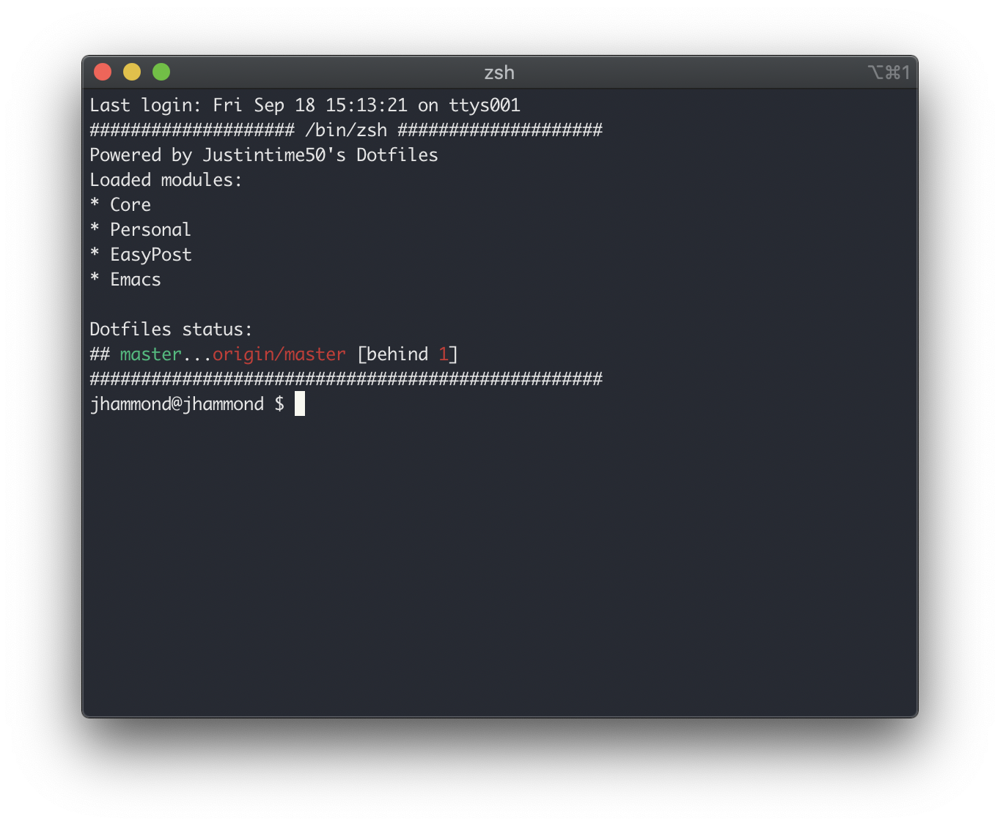

<div align="center">

# Dots

The simple, flexible Dotfile manager.

[](https://github.com/Justintime50/dots/actions)
[](LICENSE)



</div>

Dots is a simple Dotfile manager that is incredibly flexible. Your workflow is different from everyone else, why conform to an opinionated set of dotfile logic?

Dots was created because projects such as [Dotbot](https://github.com/anishathalye/dotbot) only install/link your dotfiles but don't help you sync them across computers and projects like [Dotman](https://github.com/Bhupesh-V/dotman) only help you sync your dotfiles but not actually install/link them. I needed a system that could both sync my dotfiles across my various machines while also installing them to their correct locations.

Dots does this by not making any assumptions when it comes to how/where your dotfiles should be installed. Dots allows you to specify "Dotfiles as code", saying what gets installed where and how. Simply provide a list of commands to run such as symlinking or moving your dotfiles around and Dots will take care of the rest such as warning you when your Dotfiles are out of sync, allowing you to push/pull/clean them, and installing them whenever there are updates.

## Install

Dots will override your current Dotfiles, namely `~/.zshrc` or `~/.bash_profile`. Dots will create a blank shell config file and source your remaining files into it. See [Configuration](#Configuration) below for more details.

To install Dots, simply drop it into your current Dotfiles project like so:

```bash
# 1) Add dots as a git submodule in your Dotfiles project
git submodule add https://github.com/justintime50/dots

# 2) Add Dots as a sourced script to your current shell config
echo ". $HOME/.dotfiles/dots/src/dots.sh" >> "$HOME/.zshrc"

# 3) Run `dots_sync` the first time specifying the DOTFILES_URL of your project
DOTFILES_URL="https://github.com/USERNAME/dotfiles.git" dots_sync
```

## Configuration

The only thing Dots requires for configuration is a file in the root of your Dotfiles project titled `dots-config.sh` with two functions. Much like a database migration file, we provide a list of instructions (up and down) to install or clean our Dotfiles. A simple example is shown below:

```bash
# The variable "DOTFILES_DIR" is available to use here (points to $HOME/.dotfiles)

# Instructions run when installing/updating Dotfiles
dots_config_up() {
    # Specifying a hostname is completely optional, but an effective way to ensure
    # computer-specific Dotfiles are installed properly. One config file can configure
    # multiple computers depending on their HOSTNAME
    if [[ "$HOSTNAME" == "MacBook-Pro-Justin" ]] ; then
        ln -sfn "$DOTFILES_DIR"/src/personal/home/.gitconfig "$HOME"/.gitconfig
        echo ". $DOTFILES_DIR/src/personal/home/.zshrc" >> "$HOME"/.zshrc
        ...
    fi

    if [[ "$HOSTNAME" == "Work-Computer" ]] ; then
        ln -sfn "$DOTFILES_DIR"/src/work/home/.gitconfig "$HOME"/.gitconfig
        echo ". $DOTFILES_DIR/src/work/home/.zshrc" >> "$HOME"/.zshrc
        ...
    fi
}

# Instructions run when cleaning Dotfiles
dots_config_down() {
    if [[ "$HOSTNAME" == "MacBook-Pro-Justin" ]] ; then
        rm -i "$HOME"/.gitconfig
        # .zshrc taken care of by Dots
    fi

    if [[ "$HOSTNAME" == "Work-Computer" ]] ; then
        rm -i "$HOME"/.gitconfig
        # .zshrc taken care of by Dots
    fi
}
```

## Usage

Using Dots is simple. Make changes to your Dotfiles, then run any of the following commands.

```bash
# Push Dotfile changes
dots_push

# Pull new Dotfile changes
dots_pull

# Pull/install/source Dotfile changes (recommended)
dots_sync

# Clean Dotfiles
dots_clean
```
